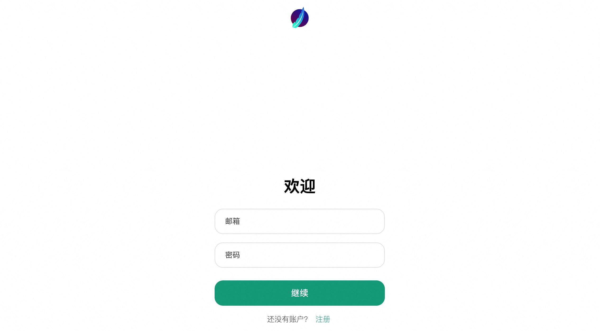
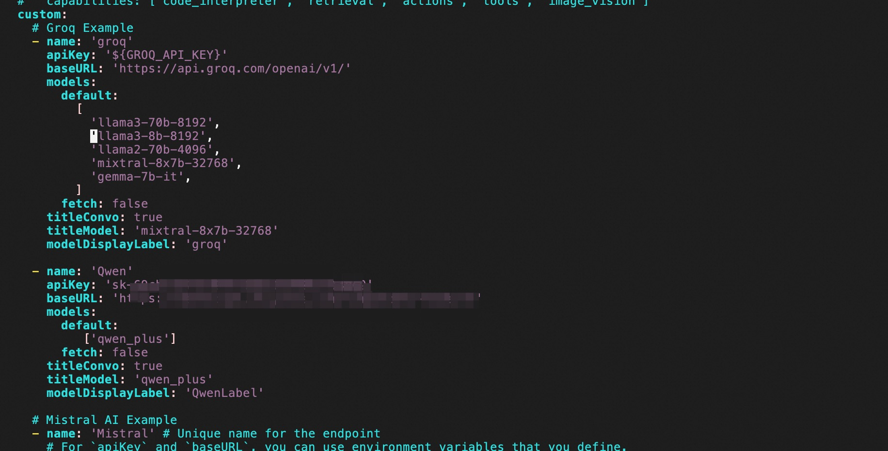
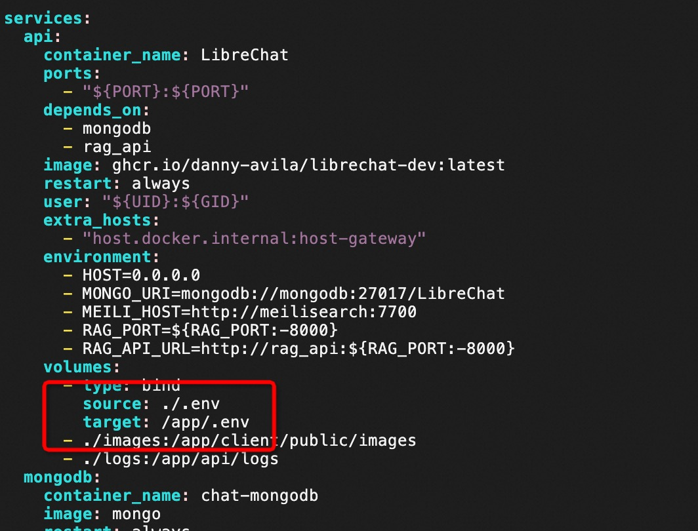
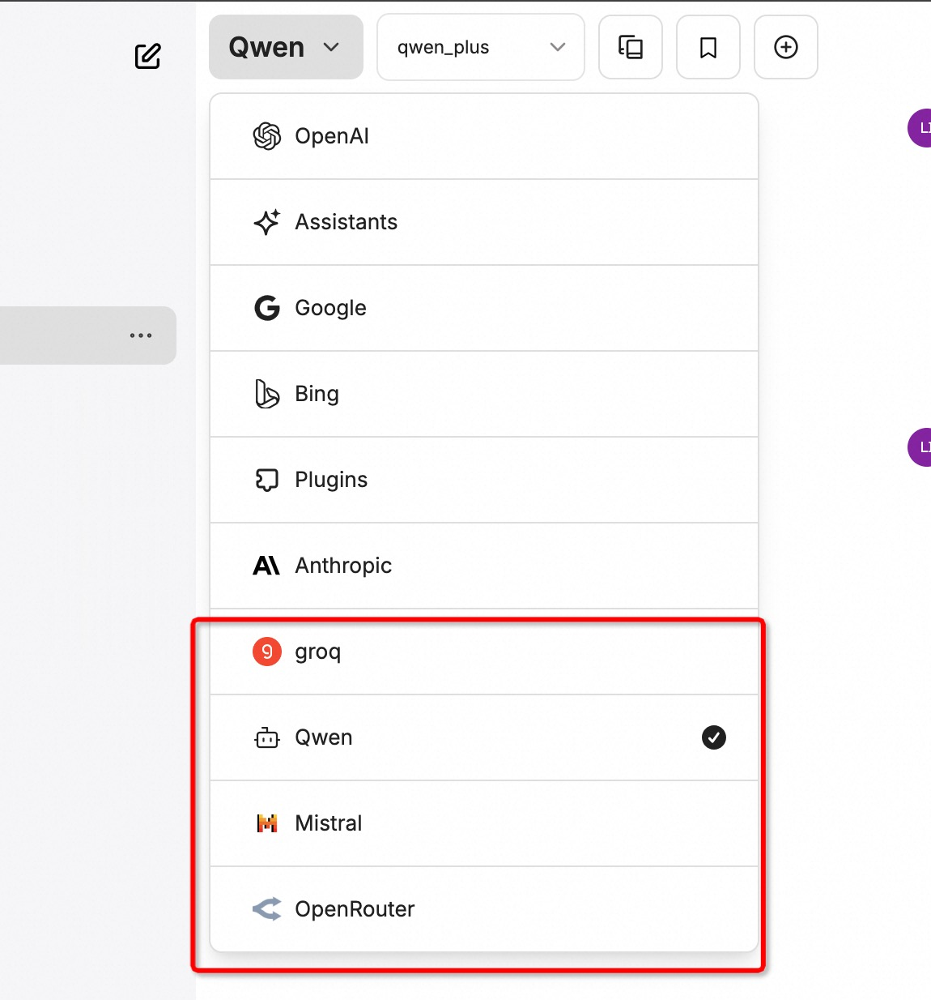

# LibreChat计算巢快速部署


>**免责声明：**本服务由第三方提供，我们尽力确保其安全性、准确性和可靠性，但无法保证其完全免于故障、中断、错误或攻击。因此，本公司在此声明：对于本服务的内容、准确性、完整性、可靠性、适用性以及及时性不作任何陈述、保证或承诺，不对您使用本服务所产生的任何直接或间接的损失或损害承担任何责任；对于您通过本服务访问的第三方网站、应用程序、产品和服务，不对其内容、准确性、完整性、可靠性、适用性以及及时性承担任何责任，您应自行承担使用后果产生的风险和责任；对于因您使用本服务而产生的任何损失、损害，包括但不限于直接损失、间接损失、利润损失、商誉损失、数据损失或其他经济损失，不承担任何责任，即使本公司事先已被告知可能存在此类损失或损害的可能性；我们保留不时修改本声明的权利，因此请您在使用本服务前定期检查本声明。如果您对本声明或本服务存在任何问题或疑问，请联系我们。

## 概述

LibreChat 是一个开源的聊天应用程序，旨在提供用户友好的交流体验。它支持多种功能，包括实时消息传递、文件共享以及集成各种第三方服务。LibreChat 以隐私和安全为重点，确保用户的数据不被滥用或收集。
更多信息，请查看官网GitHub：https://github.com/danny-avila/LibreChat

## 前提条件

部署LibreChat社区版服务实例，需要对部分阿里云资源进行访问和创建操作。因此您的账号需要包含如下资源的权限。
  **说明**：当您的账号是RAM账号时，才需要添加此权限。

| 权限策略名称                          | 备注                     |
|---------------------------------|------------------------|
| AliyunECSFullAccess             | 管理云服务器服务（ECS）的权限       |
| AliyunVPCFullAccess             | 管理专有网络（VPC）的权限         |
| AliyunROSFullAccess             | 管理资源编排服务（ROS）的权限       |
| AliyunComputeNestUserFullAccess | 管理计算巢服务（ComputeNest）的用户侧权限 |


## 计费说明

LibreChat社区版在计算巢部署的费用主要涉及：

- 所选vCPU与内存规格
- 系统盘类型及容量
- 公网带宽

## 部署架构

    

## 参数说明
| 参数组         | 参数项    | 说明                                                                     |
|-------------|--------|------------------------------------------------------------------------|
| 服务实例        | 服务实例名称 | 长度不超过64个字符，必须以英文字母开头，可包含数字、英文字母、短划线（-）和下划线（_） |
|             | 地域     | 服务实例部署的地域                                                              |
|             | 付费类型   | 资源的计费类型：按量付费和包年包月                                                      |
| ECS实例配置  | 实例类型   | 可用区下可以使用的实例规格                                                          |
|              | 实例密码   | 长度8-30，必须包含三项（大写字母、小写字母、数字、 ()`~!@#$%^&*-+=&#124;{}[]:;'<>,.?/ 中的特殊符号） |
| 网络配置        | 可用区    | ECS实例所在可用区                                                             |
|             | VPC ID | 资源所在VPC                                                                |
|             | 交换机ID  | 资源所在交换机                                                                |

## 部署流程
1. 访问计算巢LibreChat社区版[部署链接](https://computenest.console.aliyun.com/user/cn-hangzhou/serviceInstanceCreate?ServiceId=service-35cb216b9cf14efea57d)
，按提示填写部署参数，确认参数后点击**下一步：确认订单**：
    

2. 确认订单完成后同意服务协议并点击**立即创建**
   进入部署阶段。
   
   

3. 等待部署完成后就可以开始使用服务，进入服务实例详情点击LibreChat链接。
    
    

4. 注册账号，即可使用LibreChat。
    
## 其他问题
### 一、如何进入ECS
点击服务实例详情，进入ECS：


### 二、如何添加转发地址

1. 进入ECS，方式参考问题一。

2. 输入命令
```json
sudo su
cd /home/admin/application/docker_compose
sudo vim .env
```
   将会进入如下页面
 
3. 寻找需要修改的AI模型，本处以OpenAI为例，按下i键，左下角将会出现'--INSERT--'标志，通过方向键移动光标，在第一个红框处（OPEN_REVERSE_PROXY）输入转发地址。
 

4. 输入完成后按 ESC 键，左下角'--INSERT--'消失，输入:wq（冒号别漏了），保存退出。

### 三、如何添加第三方API模型

1. 进入ECS，方式参考问题一。
2. 修改librechat.yaml文件：新增第三方模型，输入命令（librechat.yaml文件可参考[链接](https://www.librechat.ai/docs/configuration/librechat_yaml/example)）。
```json
sudo su
cd /home/admin/application/docker_compose
sudo vim librechat.yaml
```
进入librechat.yaml文件（即上面代码中的sudo vim librechat.yaml），此文件中默认已有groq、Mistral、OpenRouster三个模型，如需添加，可按照其格式新增，如下新增了通义千问（Qwen）模型。（URL参考[链接](https://help.aliyun.com/zh/model-studio/developer-reference/use-qwen-by-calling-api?spm=a2c4g.11186623.help-menu-2400256.d_3_3_0.60974823saVLPu)，ApiKey参考[链接](https://help.aliyun.com/zh/model-studio/developer-reference/get-api-key?spm=a2c4g.11186623.help-menu-2400256.d_3_0.1ade4823oTgP9e))。修改方式为：
    
a. 按下i键，左下角将会出现'--INSERT--'标志，通过方向键移动光标，输入红框处内容；

b. 输入完成后按 ESC 键，左下角'--INSERT--'消失，输入:wq（冒号别漏了），保存退出。

3. 修改docker-compose文件：配置读取第三方模型，输入命令：
```json
sudo cp docker-compose.yml docker-compose.override.yml
```
此时将会新增文件：

进入文件：sudo vim docker-compose.override.yml，输入i进入修改模式，按照如下修改，修改完成后按 ESC 键，然后输入 :wq 退出。
修改前

修改后

4. 重启Docker：输入命令。
```json
sudo docker compose up
```
5. 进入LibreChat页面，第三方API模型已显示，选择Qwen即可对话。


